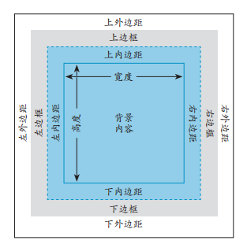
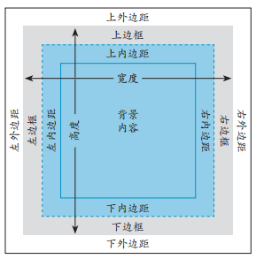

[首页](https://printjs.github.io/blog) / [CSS样式](https://printjs.github.io/blog/docs/css) / css样式重点

# css样式重点

## 一、继承

* 文本
    * color (颜色，a元素不会继承)
    * direction (方向)
    * font (字体)
    * font-family (字体系列)
    * font-size (字体大小)
    * font-style (用于设置斜体)
        * normal 默认值。浏览器显示一个标准的字体样式。
        * italic 浏览器会显示一个斜体的字体样式。
        * oblique 浏览器会显示一个倾斜的字体样式。
        * inherit 规定应该从父元素继承字体样式。
    * font-variant (用于设置小型大写字母)
        * normal 默认值。浏览器会显示一个标准的字体。
        * small-caps 浏览器会显示小型大写字母的字体。
        * inherit 规定应该从父元素继承 font-variant 属性的值。
    * font-weight (设置粗体)
    * letter-spacing (字母间距)
    * line-height (行高)
    * text-align (用于设置对齐方式)
    * text-indent (用于设置首行缩进)
    * text-transform (用于修改大小写)
        * none 默认。定义带有小写字母和大写字母的标准的文本。
        * capitalize 文本中的每个单词以大写字母开头。
        * uppercase 定义仅有大写字母。
        * lowercase 定义无大写字母，仅有小写字母。
        * inherit 规定应该从父元素继承 text-transform 属性的值。
    * visibility (可见性)
    * white-space (用于指定如何处理空格)
        * normal 默认。空白会被浏览器忽略。
        * pre 空白会被浏览器保留。其行为方式类似 HTML 中的 `<pre>`标签。
        * nowrap 文本不会换行，文本会在在同一行上继续，直到遇到 `<br>`标签为止。
        * pre-wrap 保留空白符序列，但是正常地进行换行。
        * pre-line 合并空白符序列，但是保留换行符。
        * inherit 规定应该从父元素继承 white-space 属性的值。
    * word-spacing (字间距)
* 列表
    * list-style (列表样式)
    * list-style-image (用于列表指定定制的标记)
    * list-style-position (用于确定列表标记的位置)
    * list-style-type (用于设置列表的标记)
* 表格
    * border-collapse (用于控制表格相邻单元格的边框是否合并为单一边框)
    * border-spacing (用于指定表格边框之间的空隙大小)
    * caption-side (用于设置表格标题的位置)
    * empty-cells (用于设置是否显示表格中的空单元格)
* 页面设置 (对于印刷物) `not important`
    * orphans (用于设置当元素内部发生分页时在页面底部需要保留的最少行数)
    * page-break-inside (用于设置元素内部的分页方式)
    * widows (用于设置当元素内部发生分页时在页面顶部需要保留最少的行数)
* 其他
    * cursor (鼠标指针)
    * quotes (用于指定英豪的样式)

> 当然，你也可以使用inherit值让一些不可继承的属性产生继承

## 二、当层叠样式发生冲突时


层叠三原则`特殊性`,`顺序`,`重要性`

#### 1. 特殊性

特殊性规则指***选择器***的具体程度。选择器越特殊，规则就越强。遇到冲突时，优先应用特殊性强的规则

> 特殊性最高的是ID选择器
> 尽量避免使用ID选择器，它可能会降低样式的灵活性


#### 2. 顺序

晚出现的规则，优先级更高。

> 应用于元素上的样式，被认为最晚出现，所以样式优先级最高（但不推荐这样是使用）


#### 3. 重要性

`!important`


## 三、颜色

颜色支持 *十六进制格式*，*RGB*，*RGBA*，*HSLA*等4种格式。

`color:#59007f` 其中 `59`代表R,`00`代表G,`7f`代表蓝色

HSL表示 *色相(H)* *饱和度(S)* *亮度(L)*


## 四、创建外部样式表

1. 使用link元素引用
2. 使用@import导入

> 不推荐@import,这种方式会影响页面的下载速度和呈现速度。[理由](http://www.stevesouders.com/blog/2009/04/09/dont-use-import/)


#### 使用与媒体相关的样式表
```html
<link rel="stylesheet" href="style.css" media="screen" />
<link rel="stylesheet" href="print.css" media="print" />
```
上面一个标签会在浏览器中加载。下面一个标签会在打印网页时加载

## 五、定义选择器

|类型|描述|eg|
|---|----|---|
|类型选择器|直接选择元素名称|`h1` `p`|
|id选择器|通过id查找元素|`#id`|
|类选择器|通过类查找对应元素|`.class`|
|按上下文选择元素|祖先元素通过后代来查找相应的元素,也可通过相邻元素查找|`div p` `div>p` `p+p` `p~p`|
|伪类|应用于一组 HTML 元素，而你无需在 HTML 代码中用类标记它们|`p:first-child` `p:last-child`|
|伪元素|HTML中并不存在的元素|`:first-letter` `:first-line`|
|按状态选择链接元素|根据元素不同的状态选择到对应的元素|`a:link` `a:focus` `a:hover`|
|按属性选择元素|通过HTML元素的属性来对应到相应的元素|`p[class]`|
|指定元素组|多个元素以`,`分隔|`h1,h2`|

> 上述所有的选择器，均可以混合使用

#### 属性选择器

|选择器|属性值|
|---|----|
|`[attribute]`|匹配指定属性，不论具体值是什么|
|`[attribute="value"]`|表示属性值等于这里的 value 的元素将被选中|
|`[attribute~="value"]`|表示属性值包含这里的 value 的元素将被选中（属性值还可以包含其他内容，不同的属性值之间用空格分隔） 。它必须匹配完整的单词，而不是单词的一部分|
|`[attribute|="value"]`|（前面是管道符号，而不是数字 1 或小写字母 l），表示属性值等于这里的 value 或以 value-开头的元素将被选中。不要输入连字符，浏览器知道搜索连字符（这常常用以搜索包含 lang 属性的元素，如在HTML 中， [lang|="en"] 会同时匹配lang="en" 和 lang="en-US"）|
|`[attribute^="value"]`|表明属性值以这里的value 开头（作为完整的单词，或单词的一部分）的元素将被选中|
|`[attribute$="value"]`|表明属性值以这里的value 结尾（作为完整的单词，或单词的一部分）的元素将被选中|
|`[attribute*="value"]`|表明属性值至少包含这里的 value 一次的元素将被选中。也就是说， value 不必是属性值中的完整单词|

> 多个类元素，只需要`.class1.class2`方式,便可查找到对应的元素

> `div p` div内部的所有p元素

> `div p` div内部第一层的p元素

> `p+p` p元素相邻的p元素

> `p~p` p元素后面所有的p元素

> 只有某些特定的css属性能用于`:first-letter`伪元素`font`、 `color`、`background`、 `text-decoration`、 `verticalalign`（只要 `:first-letter` 不是浮动的）、`text-transform`、 `line-height`、 `margin`、`padding`、 `border`、 `float` 和 `clear`

> 未来将用::双冒号的语法代替:单冒号

#### 更多资源
* [完整的选择器](https://www.w3.org/TR/selectors-3/#selectors)
* [完整选择器的example](https://www.w3.org/wiki/CSS)
* [让IE也使用css3选择器](http://selectivizr.com)


## 六、CSS进行布局

* 固定布局
* 响应式布局  [响应式布局起源](www.alistapart.com/articles/responsive-web-design/)


#### 盒子模型


在实际中，只有当一个元素没有内边距和边框时，它的长宽才等于css属性赋予它的长宽。当然，如果你想让它的长宽等于css属性赋予它的长宽（即使在有内边距和边框长度的时候）。你可以使用`box-sizing:border-box`。就像下图:



#### 控制元素显示和类型
造成这种情况的本质是它们的 display 属性，即块级元素被设置为`display: block`（对于 li 元素为 `display: list-item`），而行内元素被设置为 `display: inline`

行内元素与块级元素的差别

|名称|语法|特点|
|---|---|------|
|行内元素|`display:inline`|所有元素依次由***左向右***排列，不支持`width`,`height`,`margin-top`,`margin-bottom`,`float`属性|
|块级元素|`display:block`|元素依次从***上往下***排列。块级元素默认会撑满整个页面的宽度|

> 注意 如果display:inline,则padding-top和padding-bottom会侵占上下元素的位置

#### 控制元素定位

|名称|作用|值|
|----|----------|---|
|相对定位|相对于周边元素进行定位|`relative`|
|绝对定位|相对于body元素或者为`relative`定位或者`position`定位的父级|`position`|


#### 关于 vertical-align

|值|描述|
|----|----------------|
|baseline |默认。元素放置在父元素的基线上|
|sub|垂直对齐文本的下标|
|super|垂直对齐文本的上标|
|top|把元素的顶端与行中最高元素的顶端对齐|
|text-top|把元素的顶端与父元素字体的顶端对齐|
|middle|把此元素放置在父元素的中部|
|bottom|把元素的顶端与行中最低的元素的顶端对齐|
|text-bottom|把元素的底端与父元素字体的底端对齐|
|length||
|%|使用 "line-height" 属性的百分比值来排列此元素。允许使用负值|
|inherit|规定应该从父元素继承vertical-align 属性的值|

> 可以使用 vertical-align 设置表格单元格中内容的对齐方式。通常，默认的样式是中间对齐，而不像表格以外的内容那样与基线对齐。我们将在第 18 章讲解表格。除了表格以外， vertical-align 属性仅适用于行内元素，不能应用于块级元素。更多信息参见 Chris Coyier 的[解释](http://csstricks.com/what-is-vertical-align/)

## 七、构建响应式网站

#### 创建可伸缩图像

```html
<div></div>
```
```css
img {
    max-width:100%;
}
```

#### 创建弹性布局网格

创建目标宽度百分比公式

**要指定的宽度（以像素为单位）／容器宽度（以像素为单位）＝值**

媒体查询
```css
@media logic type and (feature:value) {
    /* 目标css样式规则写在这里 */
}
```

* logic - 逻辑部分是可选的，其值可以是only或not。
* type - 类型，部分是媒体类型，如screen,print等。
* feature
    * width（宽度）
    * height（高度）
    * device-width（设备宽度）
    * device-height（设备高度）
    * orientation（方向）
    * aspect-ratio（高宽比）
    * device-aspect-ratio（设备高宽比）
    * color（颜色）
    * color-index（颜色数）
    * monochrome（单色）
    * resolution（分辨率）
    * scan（扫描）
    * grid（栅格）
  
