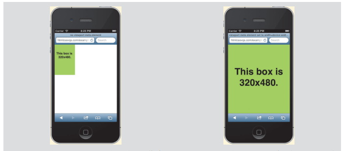

[首页](https://printjs.github.io/blog) / [CSS样式](https://printjs.github.io/blog/docs/css) / 理解视觉区域及使用视觉区域`meta`元素


# 理解视觉区域及使用视觉区域`meta`元素

视觉区域（viewport）指的是浏览器（包括桌面浏览器和移动浏览器）显示页面的区域。它不包含浏览器地址栏、按钮这样的东西，只是浏览区域。媒体查询的 width 特性对应的是视觉区域的宽度。不过， `device-width`特性不是，它指的是屏幕的宽度。

在移动设备（如 iPhone）上，默认情况下这两个值通常不一样。Mobile Safari （iPhone的浏览器）的视觉区域默认为 980 像素宽，但 iPhone 的屏幕只有 320 像素宽（iPhone 的 Retina 显示屏的屏幕分辨率有 640 像素宽，但它们是在相同的空间挤入两倍的像素，因此设备宽度仍为 320 像素）。

因此， iPhone 会像设为 980 像素宽的桌面浏览器那样显示页面，并将页面缩小以适应320 像素的屏幕宽度（在纵向模式下），如图 12.4.11 所示。结果，当你在 Mobile Safari 中浏览大部分为桌面浏览器建立的网站时，会显示将这些网站缩小了的样子。在横向模式下也是这样处理的，只不过宽度为 480 像素（iPhone5 是 568 像素）。如图 12.4.12 所示，如果不进行放大，页面通常是难以阅读的（注意不同设备的默认视觉区域宽度并不相同）。



|左图|右图|
|--|--|
|我的测试页面包含一个 320 像素×480 像素的绿色 div。 Mobile Safari 的视觉区域默认为 980 像素宽，因此 iPhone 会将该 div 缩小，以在 320 像素宽的屏幕内显示它。这就是这个绿色盒子大约占据屏幕宽度的三分之一（即320/980）的缘故|这个测试页面的代码与图 12.4.11 中页面的代码相比，除了包含设置了 width=devicewidth 的视觉区域 meta 元素以外，其他内容是完全相同的。如你所见，现在的视觉区域宽度与屏幕宽度是相同的|

幸好，有一种快速解决方案。在页面的 head 部分添加视觉区域 meta 元素即可。

```html
<!DOCTYPE html>
<html lang="en">
<head>
    <meta charset="utf-8" />
    <title>Your page title</title>
    <meta name="viewport" content="width=device-width, initial-scale=1" />
    ...
</head>
<body>
```

这段代码的重点是 width=device-width。有了这条语句，视觉区域的宽度会被设成与设备宽度（对 iPhone 来说为 320 像素）相同的值，因此在纵向模式下该宽度的页面内容会填充整个屏幕（如图 12.4.12 所示）。如果不包含这一语句，使用媒体查询的 min-width 和 maxwidth 特性将不会得到预期的结果。

代码中的 initial-scale=1. 部分对 width 和 device-width 值没有影响，但通常会包含这一语句。它将页面的默认缩放级别设成了 100%，换成纵向模式也一样。（注意， iOS6 之前的版本有一个 bug，它会裁掉一部分内容，[参见](http://adactio.com/journal/5802/)）如果不设置 initial-scale=1，在 iPhone 中，手机从纵向模式改为横向模式时，网页会被放大，从而让布局与纵向模式的一致。