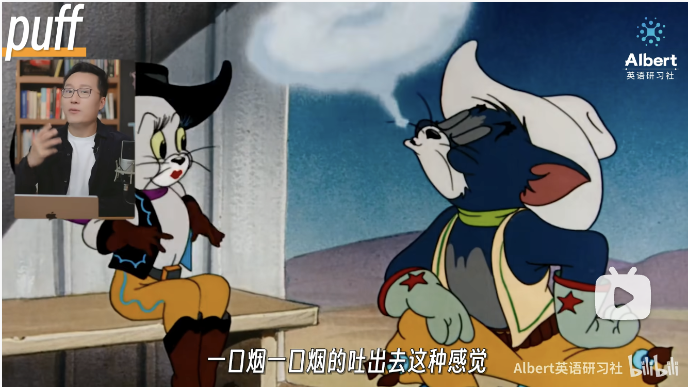
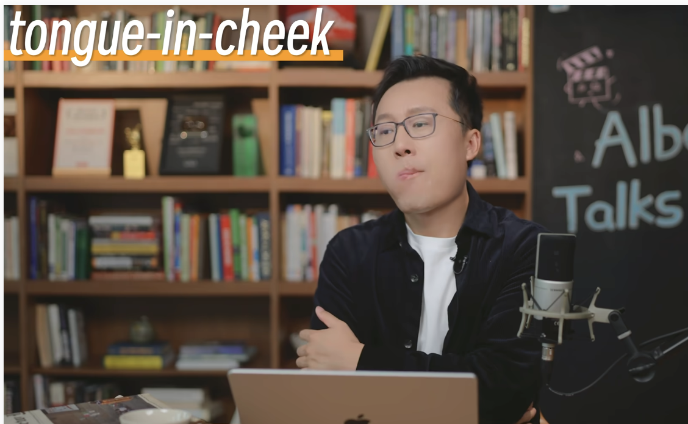
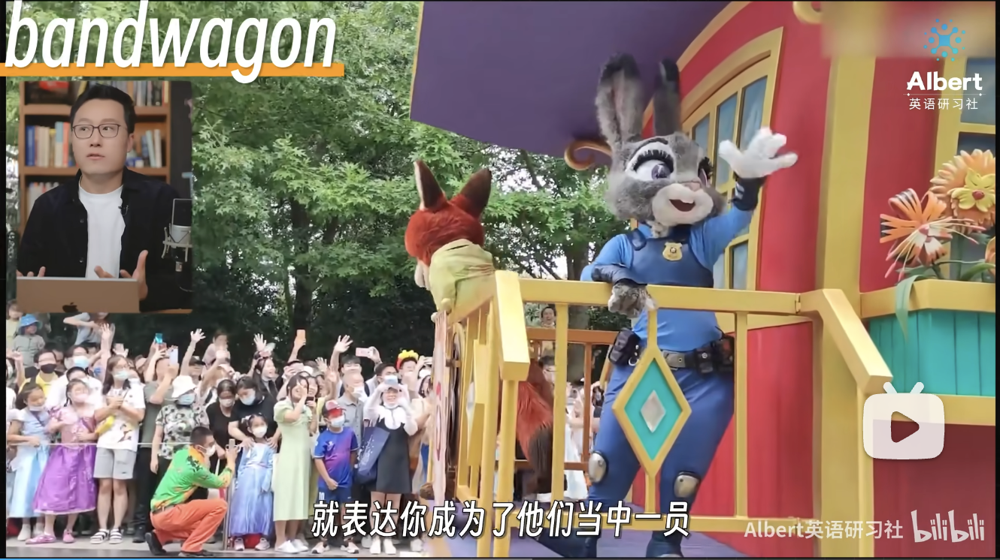
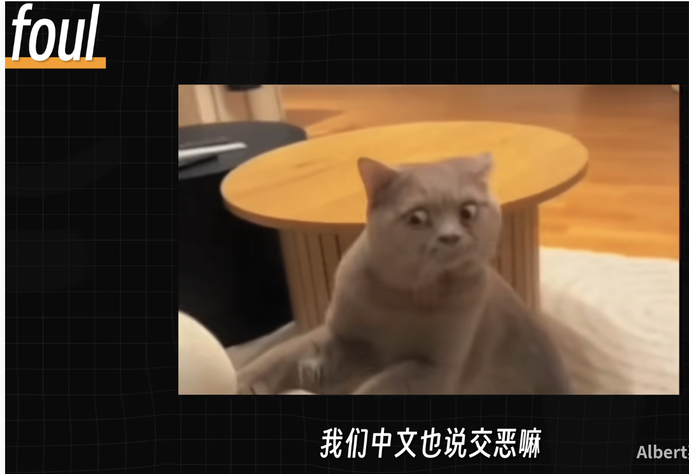

## Key words
- puff n. 一阵风 v.(smoke a cigar) 一口烟一口烟的吐出去 
- tongue-in-cheek  在不同语境有不同含义
- bandwagon n.乐队的一辆车。
- jump on the trans bandwagon 跳上乐队的车（加入他们）
- woke culture 觉醒文化
- woke lunacy 觉醒文化的疯狂行为
- I am standing behind you.
- foul 恶臭 
- virtue 道德
- signal 发出信号
- speaks volumes 滔滔不绝的讲话

## 1x
<audio id="audio" controls="" preload="none">
    <source id="mp3" src="./audio_1_1.wav">
</audio>

## 0.8x
<audio id="audio" controls="" preload="none">
    <source id="mp3" src="./audio_1_0.8.wav">
</audio>

## Cigar-puffing JK Rowling richly deserves her tongue-in-cheek moment of triumph over the historic women’s rights ruling she helped secure.

## 1x
<audio id="audio" controls="" preload="none">
    <source id="mp3" src="./audio_2_1.wav">
</audio>

## 0.8x
<audio id="audio" controls="" preload="none">
    <source id="mp3" src="./audio_2_0.8.wav">
</audio>
 
## It would have been easy for her years ago to jump on the trans bandwagon, knowing it was career suicide for writers, actors and musicians to do otherwise.
 
## 1x
<audio id="audio" controls="" preload="none">
    <source id="mp3" src="./audio_3_1.wav">
</audio>

## 0.8x
<audio id="audio" controls="" preload="none">
    <source id="mp3" src="./audio_3_0.8.wav">
</audio>

## But she realized it spelled disaster for women’s rights if men self-identifying as female were allowed to use their spaces.
 
## 1x
<audio id="audio" controls="" preload="none">
    <source id="mp3" src="./audio_4_1.wav">
</audio>

## 0.8x
<audio id="audio" controls="" preload="none">
    <source id="mp3" src="./audio_4_0.8.wav">
</audio>

## And she put her fame and profile `behind` reversing such woke lunacy.

## 1x
<audio id="audio" controls="" preload="none">
    <source id="mp3" src="./audio_5_1.wav">
</audio>

## 0.8x
<audio id="audio" controls="" preload="none">
    <source id="mp3" src="./audio_5_0.8.wav">
</audio>
 
## She and others endured appalling threats and hatred.

## 1x
<audio id="audio" controls="" preload="none">
    <source id="mp3" src="./audio_6_1.wav">
</audio>

## 0.8x
<audio id="audio" controls="" preload="none">
    <source id="mp3" src="./audio_6_0.8.wav">
</audio>
 
## Ms Rowling even fell foul of the three virtue-signaling actors her Harry Potter tales made rich — and whose silence now speaks volumes.

## (原文)[https://www.bilibili.com/video/BV1ik5jzfEKj?t=356.7]

### Cigar-puffing JK Rowling richly deserves her tongue-in-cheek moment of triumph over the historic women’s rights ruling she helped secure. It would have been easy for her years ago to jump on the trans bandwagon, knowing it was career suicide for writers, actors and musicians to do otherwise.
 
### But she realized it spelled disaster for women’s rights if men self-identifying as female were allowed to use their spaces. And she put her fame and profile behind reversing such woke lunacy.
 
### She and others endured appalling threats and hatred.Ms Rowling even fell foul of the three virtue-signaling actors her Harry Potter tales made rich — and whose silence now speaks volumes.