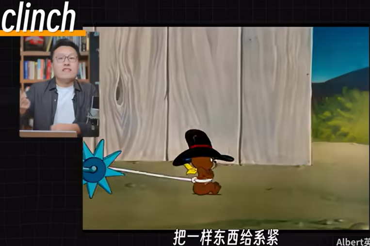

[首页](https://printjs.github.io/blog) / [english](https://printjs.github.io/blog/docs/english) / [文章](https://printjs.github.io/blog/docs/english/course_speak)

# 巴西人成为了世界杯冠军！等等，是乒乓球？！

## Key words
- bag 做动词的时候有拿下的意思，普通含义，装包
- clinch 
- Pan American 泛美洲
- stun 被打蒙了，隐身是被惊到四肢麻木

## 1x
<audio id="audio" controls="" preload="none">
    <source id="mp3" src="./audio_1_1.wav">
</audio>

## 0.8x
<audio id="audio" controls="" preload="none">
    <source id="mp3" src="./audio_1_0.8.wav">
</audio>

## Hugo Calderano bagged a historic first-ever men’s singles title for Brazil while Sun Yingsha continued China’s dominance in women’s singles at the ITTF World Cup in Macao, China, on Sunday.
 
## 1x
<audio id="audio" controls="" preload="none">
    <source id="mp3" src="./audio_2_1.wav">
</audio>

## 0.8x
<audio id="audio" controls="" preload="none">
    <source id="mp3" src="./audio_2_0.8.wav">
</audio>

## The 28-year-old Calderano completed a fairytale week with a 4-1 win over World No. 1 Lin Shidong of China in the final.

## 1x
<audio id="audio" controls="" preload="none">
    <source id="mp3" src="./audio_3_1.wav">
</audio>

## 0.8x
<audio id="audio" controls="" preload="none">
    <source id="mp3" src="./audio_3_0.8.wav">
</audio>

## World No. 5 Calderano, the first Pan American player to clinch the men’s crown, had earlier stunned Lin’s compatriot and World No. 2 Wang Chuqin 4-3 in the semifinals where he came back from 1-3 down and also saved a match point.

## [原文](https://www.bilibili.com/video/BV1rz5Cz1E3d?t=213.2)

### Hugo Calderano bagged a historic first-ever men’s singles title for Brazil while Sun Yingsha continued China’s dominance in women’s singles at the ITTF World Cup in Macao, China, on Sunday.
 
### The 28-year-old Calderano completed a fairytale week with a 4-1 win over World No. 1 Lin Shidong of China in the final.
 
### World No. 5 Calderano, the first Pan American player to clinch the men’s crown, had earlier stunned Lin’s compatriot and World No. 2 Wang Chuqin 4-3 in the semifinals where he came back from 1-3 down and also saved a match point.