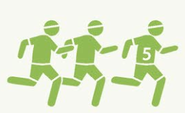

[首页](https://printjs.github.io/blog) / [english](https://printjs.github.io/blog/docs/english) / [sentences](https://printjs.github.io/blog/docs/english/sentences) / [DK](https://printjs.github.io/blog/docs/english/sentences/DK)

# Beginner level 2

## Talking about yourself

|postive|negative|question|
|----|----|-----|
|`I am` 25 years old.|I `am not` 25 years old.|*Am I* 25 years old|
|`You are` a doctor.|You `are not / aren't` a doctor.|*Are you* a doctor.|
|`He / She / it is` Noah.|He / She / It `is not / isn't` Noah.|*Is He/She/It* Noah.|
|`We / They are` doctors.|We / They `are not / aren't` doctors|*Are They/We* doctors.|

## Talking about routines

|postive|negative|question|
|----|----|-----|
|**I / You / We / They** `eat` lunch at 1pm every day.|**I/You/We/They** `do not` work outside|`Do` **I/You/We/They** `work` in an office.|
|**He / She** `eats` lunch at 1pm every day.|**He/She/It** `does not` work outside|`Does` **He/She** `work` in a school.|

## Today I'm wearing...

|postive|negative|
|----|----|
|**I** `am wearing` a jeans now|**I** `an not wearing` a jeans now|
|**You/We/They** `are wearing` a red dress.|**You/We/They** `are not wearing` a red dress.|
|**He/She/It** `is wearing` a hat|**He/She/It** `is not wearing` a hat|

## What's happening?

- What `is` **he/she/it** `doing`? -> **He/She** `is reading` a book.
- What `are` **you** `eating`? -> **I** `am eating` a salad.
- Where `are` **they/we** `going`? -> **We/They** `are going` to the store.
- Who `is` **he/she/it** `working` with? ->  **He/She/It** `is working` with Anna.

## Types of verbs

|action verb|state verb|
|----|----|-----|
|I `read` a book|I `love` books|
|I `am read` a book|None|

### state verb

|state verb|state verb|state verb|state verb|
|----|---|----|------|
|like|know|belong|fit|
|love|realise|suppose|contain|
|hate|mean|consist|seem|
|want|understand|believe|depend|
|need|prefer|remember|matter|
|agree|recognise|see|mind|
|own|appear|look (=seem)|smell|
|sound|taste|astonish|deny|
|hear|deny|disagree|please|
|satisfy|promise|surprise|impress|
|doubt|think (=have an opinion)|feel (=have an opinion)|imagine|
|concern|wish|dislike|be|
|have|deserve|involve|include|
|lack|measure (=have length etc)|possess|owe|
|weigh (=have weight)||||

## How are you feeling

- Q: **How are you feeling**?
    -A: I am **feeling** happy.

> Another way to say it "Talk about your feeling"

- Q: How are you?
    -A: I am **really/very/so** happy.

## Routines and exceptions

- I **usually/mostly/often** drive, but **right now/today/tonight** I'm walking. **usually/mostly/often** 频率副词，**right now/today/tonight** 时间标记

### Time Markers

- **At the moment**, I'm knitting. 此刻，我正在编织
- I'm leaving **right now**.
- I'm in a meeting **this morning**.
- **This afternoon**, we're shopping.
- **Today**, I'm onvacation.
- They're seeing a play **tonight**.

## What's the matter?

> In UK English, **I'm feeling sick** or **I feel sick** mean you might vomit(呕吐).

- Q: Are you okay?
    - A: No, I'm **not very well**.
    - A: No, I'm **not feeling very well**.
    - A: No, I **don't feel very well**.
    - A: No, I'm **sick**.(US)
    - A: No, I feel **ill**.(UK)
    - A: No, I'm **feeling ill**.

### Health problems with 'ache', 'pain'
- I have a **broken** foot. -> My foot **hurts**.
- I have a **pain** in my head. -> I have a **headache**.
- She has a **stomach ache**.
- I've got a **broken arm**.
- Susan's leg **huts**.
- Jo has a **pain** in her back.

### Weather adjectives

|verb|adjective|
|------|------|
|sun 晒太阳|sunny 阳光明媚的|
|cloud 阴沉|cloudy 阴天|
|fog 大雾|foggy|
|rain 下雨|rainy|
|snow 下雪|snowy|
|ice 冰|icy|
|frost 霜|frosty|
|wind 风|windy|
|storm 暴风雨|stormy|
|thunder 雷电|thundery|

## What' the weather like?
- What's the weather **like**? **like**在这里是介词，不是下面句子中的动词 "I like music"
    - Okay, but there are **a lot of clouds**. It's **cloudy**. **a lot of + noun** means **amount of noun**
    - Beautiful! It's really **hot** and **sunny**.
    - Horrible! It's **raining**. It's **wet** and **cold**. raining表示现在正在下雨
    - Really cold. It's **snowing** **a lot** and it's very **icy**.
    - There's a **storm** coming. It's very **windy**.

### The temperature
- Q
    - How hot is it ?
    - How cold is it ?
- A
    - it's **boiling**. In spoken English, **boiling** means **very hot**
    - It's 27 degrees Celsius. I'm hot.
    - It's warm.
    - It's cold.
    - It's 10 degrees Fahrenheit. I'm **freezing**. In spoken English **freezing** means **very cold**

## Making comparisons
- Greece is **warmer than** France.
- A plane is **faster than** a tran.
- Anna is **younger than** Tina.
- Ahmed is **taller than** Jack.

> For some two-syllable adjectives and those of three syllables or more, use "more" and "than" to make the comparative.
- This beach is `more` `beautiful` `than` that one.
- Surfing is `more` `exciting` `than` going to the gym.
- Flying is `more` `expensive` `than` travelling by car.
- For me, science is `more` `difficult` `than` history.
- This book is `more` `interesting` `than` that one.

## Talking about extremes

> For mest adjectives with one or two syllables, add 'est' to make the superlative.

- K2 is `higher` `than` Annapurna, but Everest is the `hightest` mountain in the world.

> For some two-syllable adjectives and for adjectives of three syllables or more. Use 'the most' before the adjetive. Then form of the adjective doesn't change.

- The Palace Hotel is `more` `expensive` `than` the Rialto, but the Biaritz is `the most expensive` hotel in the city.
- This is `the most` `expensive` hotel in the city.
- The science museum is `the most` `interesting` museum in town.
- The Twister is `the most` `exciting` ride in the theme park.
- This is `the most` `comfortable` chair in the room.

## Making choices.

- Do you want to go to Germany **or** France?
    - France.
- Do you wantg to go to Paris and Versailles?
    - Yes.

### KEY LANGUAGE "WHICH / WHAT"

> You use "which" when there are two or more possibilities in the question. Use "what" when the question is more general.

- What is the tallest building in the world?
- Which building is taller, Big Ben or the Eiffel Tower?
----
- What is the highesdt mountain in the Himalayas?
- Which mountain is higher, the Matterhorn or Mont Blanc?
----
- What is the fastest animal in the world?
- Which animal is the fastest, a lion, a rhino, or a cheetah?

## Using large numbers

- 100 **one hundred** or **a hundred**
- 200 **two hundred** No s at the end.
- 1000 **one thousand** or **a thousand**
- 3000 **three thousand**
- 1000000 **one million** **a million**
- 4000000 **four million**

> Add 'and' before the last two numbers to say numbers higher than one hundred.

- 2,876 **Two thousand, eight hundred and seventy-six**
- 54,041 **fifty-four thousand and forty-one**
- 296,308 **two hundred and ninety-fix thousand, three hundred and eight**
- 1,098,283 **one million, ninety-eight thousand, two hundred and eighty-three**

## Talking about dates

- His meeting is on **May 10 (tenth)**.
    His meeting is on **the 10th of May (the tenth of May)**.
- My birthday is on **May 18 (eighteenth)**.
    - My birthday is on **May the 18th (May the eighteen)**
- The party is on May **May 31 (thirty-first)**.
    - The party is on **the 31st of May (the thirty-first of May)**

### using "was born"
> Use "was born" to talk about someone's date or year of birth.
- Jim `was born` in
    - **1975  nineteen seventy-five**
    - **2015  twenty fifteen**

### using "ago"
> You use "ago" to say how many years before now something happened.
- Plato `was born` around 2500 years **ago**.

## Talking about the past

- Jill `is` a businesswoman now.
    - She `was` a student in 1985.

- **I/He/She/It** `was` a student.
- **You** `were` a student.
- **We/They/You** `were` students.

### negative and question

|negative|question|
|----|----|
|He `was` **not**/ `was`**n't** a teacher in 2024|*Was he* in India?|
|They `were` not / `were`**n't** at the park yesterday.|*Were they* late for school?|

## Past Events

|sentences|negative|
|----|----|
|**I/You/He/She/We/They** `played` tennis|**I/You/He/She/We/They** `didn't play` tennis. |

### USING "when" with the past simple

> To say when in someone's life something happened. you can either use 'in' with the year, or 'when' with the person's age.

- He **moved** to England in 1990.
- He **moved** to England when he was 10 years old.

## Past abilites

### Could for past abilites
> Use "could" to talk about an ability you once had.You can use "when" plus a time setting to say when you had the ability.

- I `can't` climb trees now, but I `could` when I was younger.
- I `couldn't` go to China **last year** because it was too expensive. **last year 去年**
- **Last year**, she `couldn't` run very far, but yesterday she ran a marathon.

## Irregular past verb

- I often `go` to the moives.
- I `went` **last night**昨晚, but I `didn't go` **last week**上周.

### Irrgular verb, question in the past simple

- They `bought` a new car.
    - `Did` they `buy` a new car ?
- She `saw` the show **last night**?
    - Did she `see` the  show **last night**?

## Telling a story.

- It's a movie `about` a mystery.
- It's a story `about` a lawyer.
- The play is `about` two brothers.

### Descibing your opinions

- I `liked/enjoyed/loved` the play because it was `funny/romantic/thrilling`. 使用积极的`动词`，搭配积极的`形容词`
- Kahil `didn't enjoy/didn't like/hated` the show because it was `boring/slow/silly`. 使用消极的`动词`,搭配消极的`形容词`

## Asking about the past

### "YES/NO" question in the past simple.
- `Did` you `have` a good holiday?
    - Yes, we `went` to India.
- `Did` you `visit` the Taj Mahal?
    - No, we `didn't`.

### Question Word with the past simple.

- How `did` you get here?
    - By taxi.
- Where `did` you go on vacation?
    - We `went` to Paris.
- What `did` you see in Paris?
    - The Eiffel Tower.
- What `did` you do on vacation?
    - We `went` hiking.
- When `did` you come home?
    - This morning.

## Applying for a job.
- look for a job
- resume
- apply for a job
- have an interview
- get the job
- start the job

## Types of questions

### Object Question (include auxiliary verb)
- `Who` **did** you see at lunchtime?
    - I `saw` **my boss**
- `What` **did** he eat?
    - He `ate` **steak and salad**.
- `Who` **did** you speak to?
    - I `spoke` to **Jane**.
- `Who` **did** Ben call?
    - The Bank
### Subject Question (used verb directly)
- `Who` **called** the bank?
    - Ben **called** the bank.
- `Who` **paid** the staff?
    - The Boss **paid** the staff.
- `What` **broke** the window?
    - The ball **broke** the window.

## Someone,anyone,everyone.

- Did **anyone/anybody** call me this morning?
- Yes, **someone/somebody** called you at 11 o'clock.

- Why is there **no one** in the office?
- **Everyone/Everybody** `is` at the big meeting? **使用单数在everyone和everybody后面**

## Making conversation

- I `went` to the movies last night?
    - `Did` you?
- Yes, I `saw` that new thriller. `It was` really exciting.
    - `Was it`?
- I `play` golf every weekend last night?
    - `Do` you?
- He `wasn't` in the office this morning?
    - `Wasn't` he?
- `They didn't go` to the theater last night.
    - `They didn't`
- `There isn't` any milk left in the fridge.
    - `There isn't`

## Future arrangements

## 用时间短语和现在进行时，表示将来的事情

- **At the moment** Dave `is working`, but **tomorrow** he `is playing` golf.
- Jack`'s playing` soccer **now**, **then later** he`'s seeing` a movie.
- **Today**, I`'m playing` tennis, but I`'m playing` golf **tomorrow**.
- Sue `is studying` **now**, but **this evening** she`'s visiting` a friend.
- I`'m reading` **at the moment**, but I`'m going` running **later**.
- I`'m working` **on Tuesday**.
- I`'m retireing` **in June**.
- I`'m working` **on May 9th**.
- i`'m retireing` **in 2035**

### Making excuses (托词，借口)
- Would you like to go to the movies tonight?
    - **Sorry, I can't**. I`'m working` late.
    - **I'd like to, but** I`'m going` to the dentist.
    - **I'd love to, but** I`'m meeting` friends.
    - **That would be fun, but** I`'m visiting` familly.
    - **That sounds nice, but** I`'m playing` baseball.

## Plans and intentions
> You can use 'going to' to talk about what you want to do in the future.

### Going to for future plans
- I'm `going to` buy a new car.
- We are `going to` cook dinner tonight.
- Sam is `going to` get fit before his next birthday.
- I'm `not going to` eat any chocolate this month.

### "by" with time words and phrases

> "By" followed by **a noun or time phrases** means something will happen at some point before that time.

- I am `going to` paint the house **by** June.
- I am `going to` write to you **by** next weekend.
- I am `going to` get fit `by` this time next year.

## What's going to happen

> Use the future with "going to" to make a prediction about the future when there is evidence in the present moment to back up that prediction.

- **Look at those clouds**. It`'s going to` rain soon.
- **The hill is too steep**. John `is going to` crash!
- **She studies a lot**. She`'s going to` pass her exam.
- **He's wearing a raincoat**, so he`'s going to` get wet.
- **Joe fell asleep in the exam**. He`'s going to` fail.

## Making predictions

> Use "will" to say what you think weill happen in the future when you don't have firm evidence for your prediction. It's a slightly different meaning from futures using "going to"

- That new movie is great. They `will` love it.
- Jane `will` like the new house. It's really nice.
- It`'ll` rain every this summer.
- She`'ll` be really angry when she finds out.
- He `won't` be late for work again this year.
- They`'ll` enjoy their holiday in Venice.

### Think with will

> If you're not sure about something. you can begin a sentence with "I think" This shows you are giving your opinion

- We **think** that he`'ll` like the play.
- I **think** that we`'ll` have enough food for the party.
- He **thinks** it'll be a great show tonight.
- She doesn't **think** she`'ll` get that job at the bank.

### Going to and will

> Use "going to" when you have evidence for a prediction. Use "will" when a prediction is an opinion without evidence

- I **think** Number 5 `will` win.

- Look, Number 5 `is going to` win.

