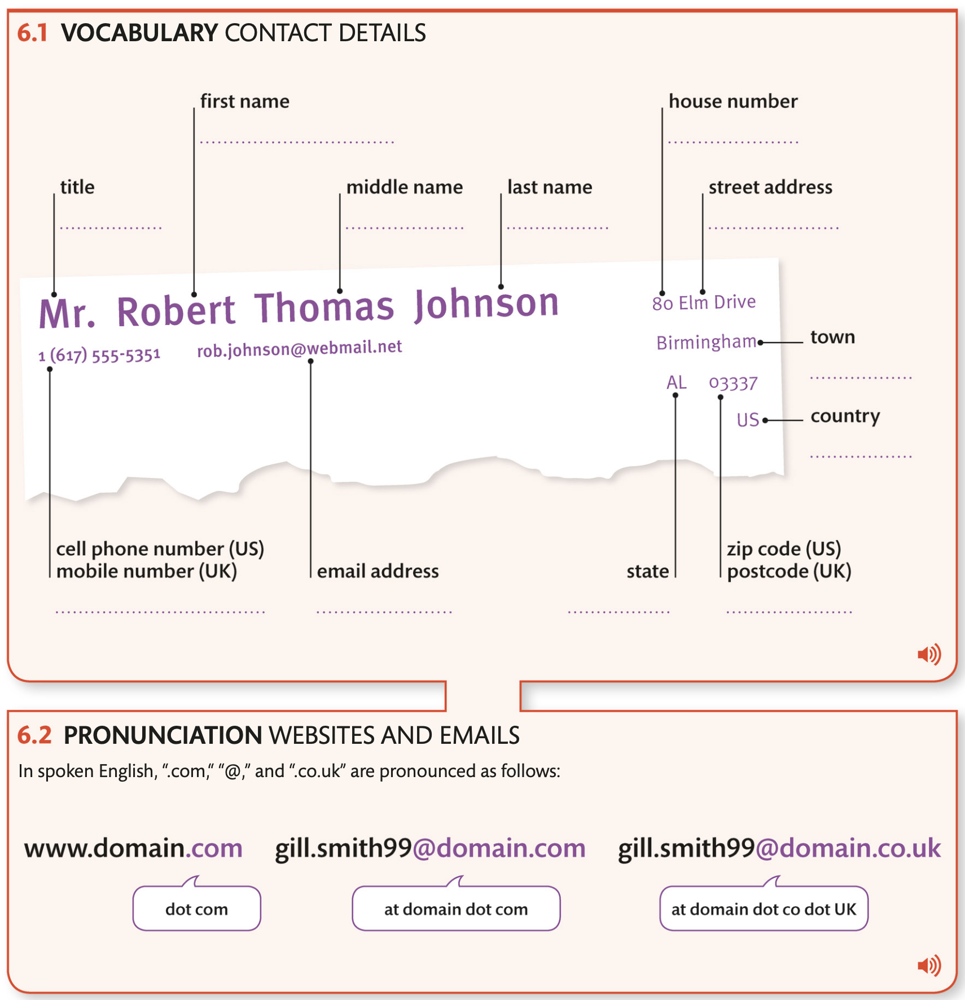
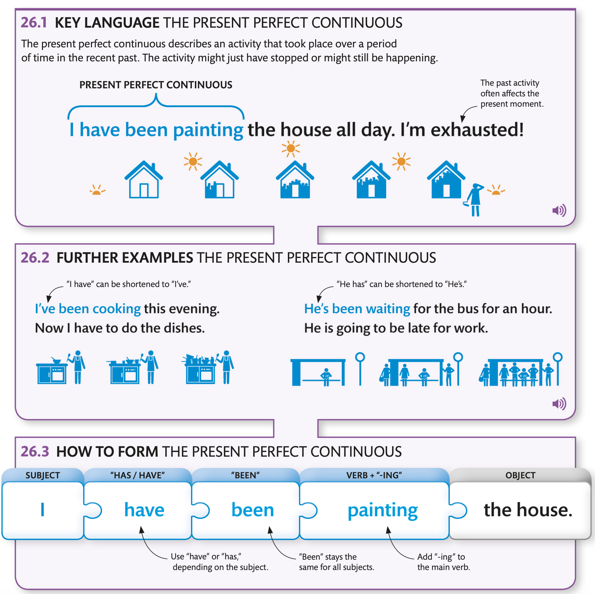
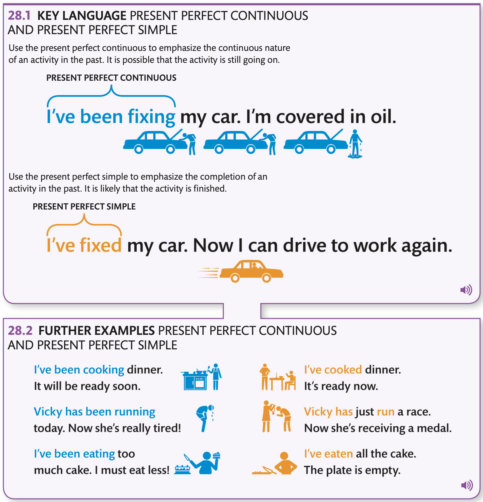

[首页](https://printjs.github.io/blog) / [english](https://printjs.github.io/blog/docs/english) / [sentences](https://printjs.github.io/blog/docs/english/sentences) / [DK](https://printjs.github.io/blog/docs/english/sentences/DK)

# Intermediate level 3

## Making Conversation

|Statement|Question Tag|
|-----|------|
|**The music** `is` very loud|`isn't` **it**?|
|**The music** `isn't` very loud|`is` **it**|
|**He**`'s` tall|`isn't` **he**|
|**I**`'m` late|`aren't` **I** (For statement with I use `aren't` not `amn't` in negative question tag)|
|**I**`'m` not talking too much|`am` **I**|
|**You**`'re` cold|`aren't` you|

### Formal and Informal conversations

|FORMAL|INFORMAL|
|------|------|
|A: Good morning Ms.White. How are you. B: I'm very well thank you.|A: Hi, Jane, How are you doing? B: Fine. thanks|
|Z:May I introduce Emma Wilson. A: I'm very pleased to meet you. B: I'm delighted to meet you too|Z: This is Marta. A: Great to meet you. B: me, too|

## Where things are

## Numbers and stattistics

## Time and dates

- **nine thirty** === **half past nine**
- **three forty five** === **quarter to four**
- **nine twenty-five** === **twenty-five past nine**
- **three fifty** === **ten to four**
- **nine twenty-seven** === **twenty-seven `minutes` past nine** 说分钟是你想要精确时间
- **three fifty-one** === **nine minutes to four**

> You might hear the  24 hours clock in public transport announcements

- 07:00 -> **oh seven hundred**
- 08:43 -> **oh eight forty-three**
- 16:26 -> **sixteen twenty-six**

### Dates in American English are usually written with the month first. Dates in British are usually written with the day first.

|US|UK|
|-----|------|
|03/10/04|10/03/04|
|03/10/2004|10/03/2004|
|March 10, 2004|10 March 2004|
|March 10th,2004|10th March 2004|
|March tenth,two thousand and four|the tenth of March, two thousand and four|

## Contact details

### Pronunciation numbers

- 0
    - zero
    - "oh"
    - nought
- 44
    - four four
    - forty-four
    - double four
- 555
    - five five five
    - treble five
    - five double five
    - triple five

## Talking about jobs.

> job and work
- Noun
    - I enjoy my `job`.
    - I'm looking for a `job`.
    - I enjoy my `work`.
- Verb
    - I have so much `work` to do.
    - I start `work` at 9 o'clock
    - I get to `work` by bus.

## Routine and free time

> 所有频率都是由高到低

### 用这些词语表示事情总是发生或者经常发生
- I `always` take a shower in the morning.
- I `nearly always` take a shower in the morning.
- I `very often` take a shower in the morning.
- I `usually` take a shower in the morning.
- I `often` take a shower in the morning.
- I `frequently` take a shower in the morning.
### 用下面的词语表示事情在某些时候发生
- I `regularly` cycle to work
- I `sometimes` cycle to work
- I `occasionally` cycle to work
### 用下面的词语表示很少发生或者几乎不发生
- I `rarely` eat dinner after 10 at night.
- I `hardly ever` eat dinner after 10 at night.
- I `almost never` eat dinner after 10 at night.
- I `never` eat dinner after 10 at night.

### Word order

> You can also descibe frequency with more precise expressions. Unlike adverbs of frequency. **these must sit at the end of a phrase**.

|频率词|短语|
|----|----|
|I `often/regularly/hardly ever`go running.(动词在频率词的后边)|I go ruinning `five times a week/every Tuesday/once a year`(在动词的后边)|

### Word order with be

|verb|be|
|-----|-----|
|I **often** `take` the rain|The traffic `is` **often** very bad.|
||The weather `is` **usually** nice here.|
||I`'m` **always** tired in the morning|
||He`'s` **often** late for meetings.|
||You`'re` **hardly** ever sick.|

## Describing people

### Adject order

||opinion|size|shape|age|color|noun|
|---|---|---|---|---|---|---|
|She has|beautiful||curly||brown|hair.|
|He is a||tall,|slim|old||main.|

## Daily routines

> Collocations are groups of words that are often used together in English. you can use them to make your spoken English sound more natural.

> "The" is often included
- He `makes the bed` every morning. 整理床铺
- Show `mows the lawn` every week.
- I `walk the dog` every day.
- I `do the cooking` every evening.
- They `do the laundry` every Sunday.
- He`folded the towels` this morning.
- She `did the dishes` this afternoon.
- He's `watering the plants` now.
- They're `clearing the table` after lunch.
- I'll `sweep the floor` this afternoon.
- I'll `load the dishwasher` in a minute.

### Present simple and present continuous

|每日的历程|现在正在进行|
|----|----|
|I usually cook at home,|but `I'm eating out` tonight.|

## Separable phrasal verbs

||separted|
|-----|-----|
|He is `picking up` litter.|He is `picking` litter `up`.|
|He is `cutting down` trees.|He is `cutting` trees `down`.|
|She `gave out` the town maps.|She `gave` the town maps `out`.|
|The theater is `putting on` a show|The theater is `putting` a show `on`|
|Can you `check out` the menu?|Can you `check` the menu `out`|
|I'm `taking back` those library books.|I'm `taking` those library books `back`|

> if the object of a sentence with a separable phrasal verb is a **pronoun(like it)**. it must go between the verb and the partice.

- He is `picking` **it** `up` **CORRECT**
    - He is `picking up` **it**. **INCORRECT**

## Comparing places

> Use modifiers before comparatives to be more precise about the comparison you are makeing.

- The tree is `a lot/ much` **taller than** the building.
- The tree is `a bit/slightly` **taller than** the building.

> You can use `easily` or `by far` to make superlative adjectives stronger. or `one of` to show that the superlative belongs to a group of things.

- The clock tower is `easily / by far` **the tallest** building in the town.
- The clock tower is `one of` **the tallest** `buildings` in the town. 如果使用了one of，切记后面的被形容对象使用复数
- This is `by far` **the most expensive** shop in the street.

## Likes and dislikes

> In English, many adjectives are formed by adding `-ing` or `-ed` to verbs. These adjectives often have different meanings and can be used to descibe likes and dislikes

> Adjectives that end in `-ing` describe the effect something has. Adjectives ending in `-ed` describe how something is affected.

- The spider is frighten`ing`.
    - The man is frighten`ed`.
- The fireworks are amaz`ing`.
    - She is amaz`ed`.
- The wasp is annoy`ing`.
    - He is annoy`ed`.
- The roller coaster was thrill`ing`.
    - They were thrill`ed`.
- The vacation is relax`ing`.
    - He is relax`ed`.

### Modifiying words

> `Quite`,`really`,`absolutely` can be used to modify how much you like or don't like something. These modifying words must go before the verb.

> 这三个词语后面的动词只能是所列举的，不能乱用

- I `quite` **enjoy / like** cycling.
- I `really` **like / love / enjoy / don't like / hate** cycling.
- I `absolutely` **love / hate** cycling.

## Early years

> To emphasize a verb in the past simple, replace it with `did` plus the base form of the verb.

- You `called` your dad about babysitting Kim tonight, didn't you ?
    - No, but I `did call` Aunt Sue. She;ll be here soon.
- I thought you `asked` Maya to put away these toys.
    - I `did ask` her. I think she forgot.
- Are you sure you `bought` the birthday cake?
    - Yes, I `did buy` it. It's on the top shelf.

## Changeing meaning

### Prefixes and suffixes

- `un=not` 
    - Jane is `un`likely to study history because she prefers science.
    - Please clean up your desk. It's very `un`tidy.
- `re=again`
    - Tom was `re`writing his essay bacause his teacher gave him a low grade.
    - I didn't work very hard this year. I'll have to `re`take my exams.
- `-ful=full of`
    - The principal was so pleased that the play was success`ful`.
    - Now that I've passed my exams. I am hope`ful` for the future.
- `-less=without`
    - I don't like the food in the cafe. It is taste`less`.
    - What a boring lecture. Being there was point`less`.

## Places I have been

> In English, the present perfect tense is used to talk about **recent or repeated past events**. The past simple is used to say exactly **when those events happened.**

- **To give new information** Hi! I `have arrived` in London! My plane landed five minutes ago.
- **repeated action that continues to happen** I `have visited` California every summer since I was 18.
- **an event start that started in the past and is still happening now.** Olivia `has gone` on trip to Egypt.

### Present perfect and past simple

> The **present perfect** is used for talking about **a recent event or ongoing action**.

- Olivia `has gone` to Egypt on vacation.

> The **past simple** gives specific details about when a completed event happened.

- Olivia `went` to Egypt **last week**.

### Present perfect and past simple in US English

1. **(US)** No dessert for me! I `ate` too much.
2. **(UK)** No dessert for me! I`'ve` eaten too much.
3. **(US)** I can't find my passport. `Did` you `see` it?
4. **(UK)** I can't find my passport. `Have` you `seen` it?

## Things I have done

- **already** 表示事情已经完成，而且是尽可能的早于预期. I`'ve` **already** `packed` my bags, so I can relax now.
- **just** 表示不久前，刚刚 I`'ve` **just** called a cab. It should be here soon.
- **yet** 表示一些事情期待发生，用语否定句中。The cab `hasn't arrived` **yet**. I hope I won't be late.
- **still** 表示一种情况或者一个行为正在继续 The cab **still** `hasn't arrived`. Where can it be?

## Activities in progress

### **For** and **Since**

> English uses 'for' with present perfect continuous to show the length of time that an action has taken. 'since' is used to show the starting point of the action.
- I `have been painting` the house `for` three hours.
- He`'s been tiling` the kitchen `for` a week.
- I `have been painting` the house `since` 3 o'clock.
- He`'s been tiling` the kitchen `since` last Wednesday.

## My talents and skills

> When you see evidence that something has happened, you can use the present perfect continuous to ask questions about it.
> English uses present perfect continuous questions to ask about ongoing actions in the recent past. especially when there is evidence that an action has taken place.

- `Have you been baking` a cake? It smells delicious.
- `Have you been gardening?` You flowers look nice.
- `Have you been learning` the guitar?
    - 
- James looks good. `Has he been working out`.

### How long

> You can add **how long** to the beginning of **present perfect continuous** questions to ask about the duration of actions in the past. Answer to these question use **the present perfect continuous** with with **for** or **since**

- **How long** `have you been playing` the guitar?
    - I`'ve been playing` the guitar **for five months / since January**
- **How long** `has he been learning` the piano?
    -He`'s been learning` the piano **since last May**.
- **How long** `has she been singing` in the choir?
    - She`'s been singing` in the choir **for nine months**.

## Activities and their results
> English uses the present perfect continuous to talk about recent activities that are probably still ongoing. Use the present perfect simple to talk about finished activities.

## Everyday problems

> Prefixes that mean *not* are called negative prefixes. Many words that have negative prefixes are useful for talking about everyday workplace and urban problem.

- Maria is very **organized**. Her desk is always **tidy**.
    - Kevin is very `dis`**organized**. His desk is always `un`tidy.

- The traffic is so bad it's `im`**possible** to get to work on time.
- I think you've `mis`**understood** what I was trying to say.
- It's `ir`**responsible** to drive faster than the speed limit.
- It's `il`**legal** to part in the middle of the road.

## General and specific things.

> English uses **no article(zero article)** to talk about things in general. Use `the`**(definite article)** to talk about specific things.

- Sam is always buying `clothes`.**General** `The clothes` **Specific** he bought yesterday were expensive.
- I like reading `books`.`The` last `books` I read was very good.
- You take great `photos`.`The photo` in your living room is beautiful.
- I usually save `money`, but I'm going to spend `the money` I got for my birthday.
- Jeeny has lots of `shoes`.`The shoes` she's wearing today are green.

### Have and Have Got

|Have|Have Got(Only used in spoken Uk English)|
|------|-------|
|I `have` a new phone.|I`'v` got a new phone.|
|I don't `have` a dishwasher|I `haven't` got a dishwasher.|
|Do you `have` your keys?|`Have you got` your keys?|

## Myself, yourself

- `He` cut `himself` while chopping vegetables.
- `She`'s teaching `herself` to cook.
- `He` introduced `himself` to the other party guests.
- That pan is very hot. Don't burn `yourself`.
- Did `they` enjoy `themselves` at the party?

|Subject Pronouns|Reflexive Pronouns|
|-----|------|
|I|myself|
|you|youself yourselves|
|he|himself|
|she|herself|
|it|itself|
|we|ourselves|
|they|themselves|

