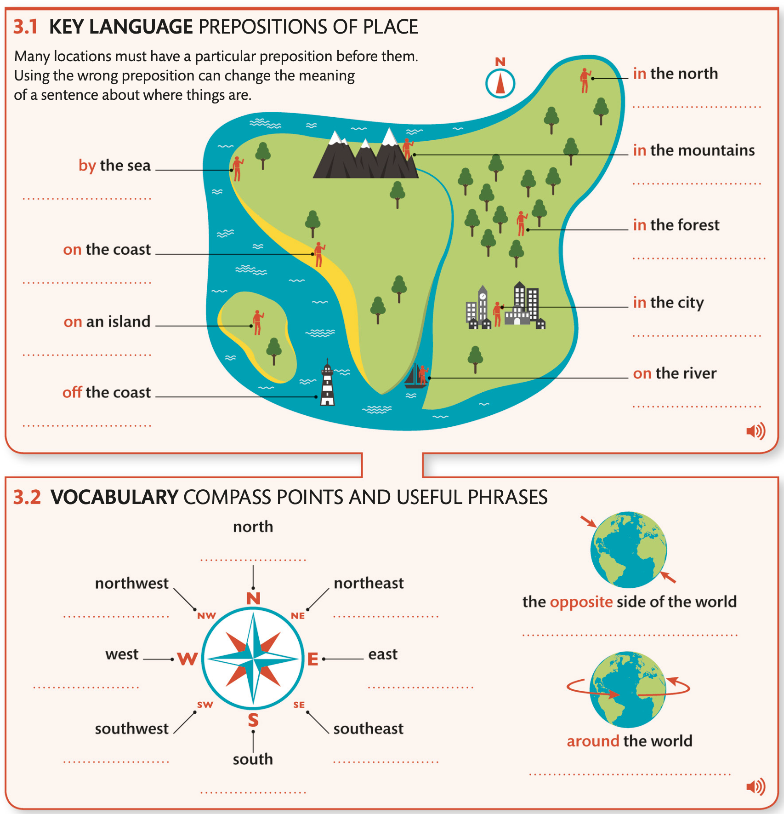
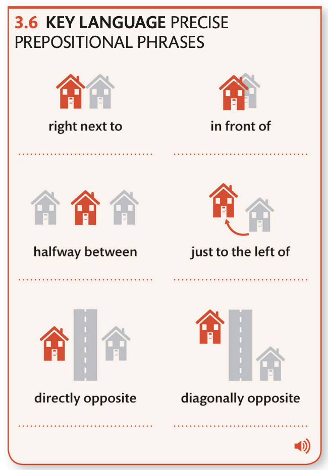
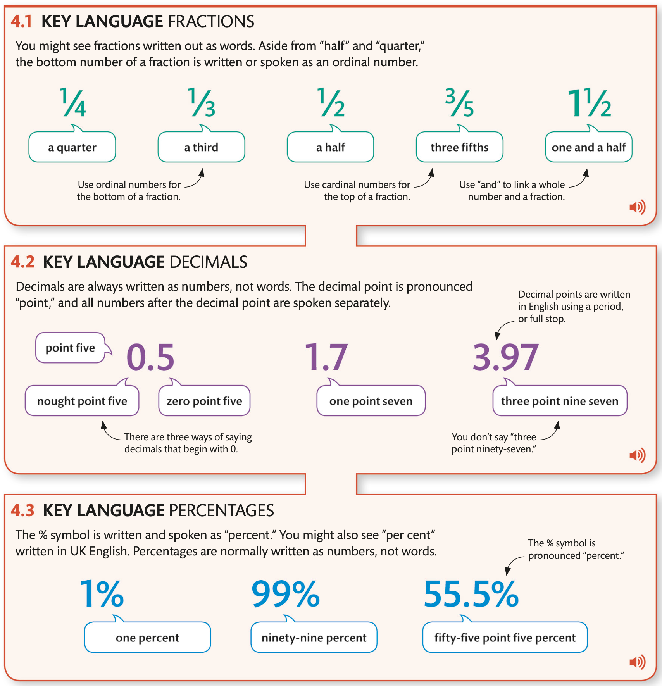

[首页](https://printjs.github.io/blog) / [english](https://printjs.github.io/blog/docs/english) / [sentences](https://printjs.github.io/blog/docs/english/sentences) / [DK](https://printjs.github.io/blog/docs/english/sentences/DK)

# Intermediate level 3

## Making Conversation

|Statement|Question Tag|
|-----|------|
|**The music** `is` very loud|`isn't` **it**?|
|**The music** `isn't` very loud|`is` **it**|
|**He**`'s` tall|`isn't` **he**|
|**I**`'m` late|`aren't` **I** (For statement with I use `aren't` not `amn't` in negative question tag)|
|**I**`'m` not talking too much|`am` **I**|
|**You**`'re` cold|`aren't` you|

### Formal and Informal conversations

|FORMAL|INFORMAL|
|------|------|
|A: Good morning Ms.White. How are you. B: I'm very well thank you.|A: Hi, Jane, How are you doing? B: Fine. thanks|
|Z:May I introduce Emma Wilson. A: I'm very pleased to meet you. B: I'm delighted to meet you too|Z: This is Marta. A: Great to meet you. B: me, too|

## Where things are

## Numbers and stattistics

