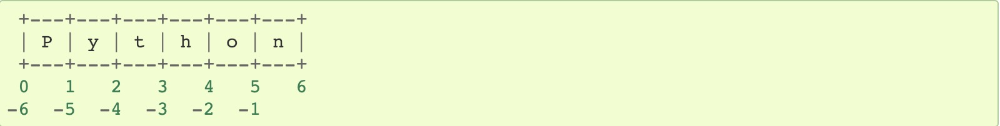

# python的非正式介绍

## 数字

```python
2+2 # 4
50-5*6 # 20
(50 - 5*6) / 4  # 5.0
8/5 # 1.6
```

* `/`符号总是返回的浮点数
* `//`符号总是返回的是整数，并且是向下取整的数
* `*`乘法
* `**`指数乘法
* `%`求余数

## 字符串

在python中，字符串是不可变元素

python字符串可以像数组一样通过索引获取对应的元素

example
```python
str = "python"
print(str[0]) # "p"
print(str[-1]) # "n"
```
如果索引指向了一个不存在的区域，则会抛出异常



字符串还支持切片

```python
str = "python"
# str[i,j] 的含义是，第i个元素到第j个元素，但不包括j的位置元素
# 若str[:j] ,则表示i = 0
# 若i和j都为负数，则元素索引也依然是从小到大,若i为负数，则j不能为正整数和0
# 若j到达一个不存在的边界，则饭回的是i到len之间的字符串
```

## 列表

列表是可变元素

列表同样具有索引和切片

## 迈向编程的第一步

```python
a, b = 0, 1
while a < 10:
    print(a)
    a, b = b, a+b
```