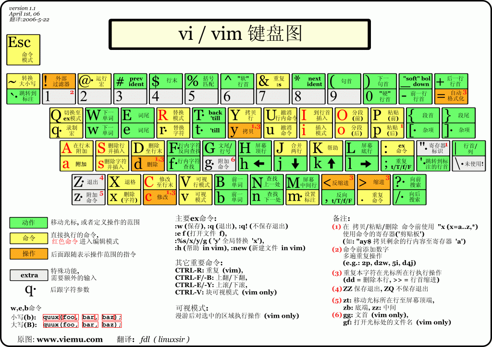

[首页](https://printjs.github.io/blog) / [vim](https://printjs.github.io/blog/docs/vim) / [vim操作](https://printjs.github.io/blog/docs/vim/basic)

# vim操作

## vim 操作表

## vim一些基本操作

### 命令模式下
* h 鼠标光标向左移动
* j 鼠标光标向下移动
* k 鼠标光标向上移动
* l 鼠标光标向右移动
* V 进入行可视模式（选择最小单元为行）
* v 进入可视模式
* Y 复制
* P 黏贴
* : 进入底线模式
* / 进入底线模式，并且全局查找对应的字符串
* $ 进入行尾
* ^ 进入行首
* N 向上查找
* n 向下查找

### 底线模式
* w 保存
* q 退出
* q! 不保存退出
* wq 保存退出
* Enter 进入命令模式
* Esc 进入命令模式
* / 查找对应的字符串
* :1,$s/target/target1/g 全局查找target字符串，并且其替换为target1字符串
* :1,$s/target/target1/gc 全局查找target字符串，并且其替换为target1字符串，再每一次替换前需要确认